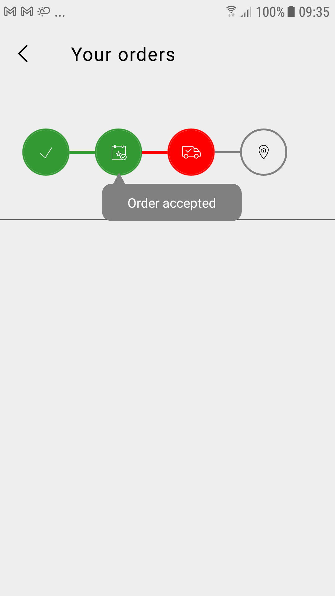

# react-native-customizable-stepper
A highly customizable stepper component for react-native



## Installation
```
npm i react-native-customizable-stepper
```

## Usage Snippet

Make sure the images imported are single-colored png files 

```
import step1Icon from '../../../assets/img/step1.png';
import step2Icon from '../../../assets/img/step2.png';
import step3Icon from '../../../assets/img/step3.png';
import step4Icon from '../../../assets/img/step4.png';

const stepDetailsList = [
    { stepName: "Order confirmed", iconImg: step1Icon },
    { stepName: "Order accepted", iconImg: step2Icon },
    { stepName: "Driver assigned", iconImg: step3Icon },
    { stepName: "Order delivered", iconImg: step4Icon },
]
```
```
<View style={{ height: 50, width: 100 }}>
    <Stepper 
        successColor="#339933" 
        failedColor="#ff0000" 
        numberOfSteps={4} 
        lastActivated={2} 
        lastFailed={3} 
        stepDetailsList={stepDetailsList} 
        hoverBackground="grey" hoverTextColor="white"
    />
</View>
```

# Props

## successColor

The color which should be used to highlight the successful steps

## failedColor

The color which should be used to highlight the failed steps

## numberOfSteps

The number of steps required to display. The library automatically utilises the complete space to give the optimum size for each step bubble

## lastActivated

Last Successful Step. If there are 4 steps and the last successful step was 2, please enter 2

## lastFailedStep

Last Failed Step. If there are 4 steps and the last successful step was 2, and the last failed step was 3, please enter 3.
If there are no successful steps, it will still work

## stepDetailsList

This property can be used to give an array of details for each step, each of which includes

### stepName
Name of the step, which should be shown upon hover
### iconImg
Pass the image/icon to be displayed inside the step bubble here

### hoverBackground
Text hover bubble background color that needs to be displayed on touch of the step

### hoverTextColor
Text color on the hover


